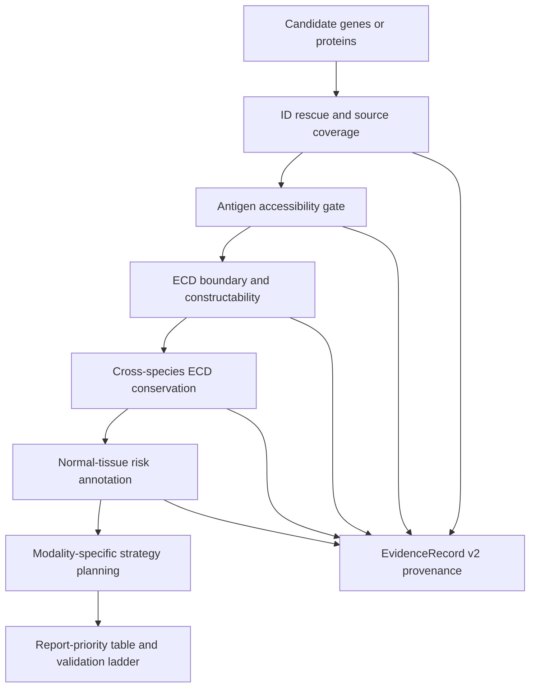

# Antigen Screening Skill

An evidence-driven Codex skill for surface-antigen triage, extracellular-domain construct planning, cross-species conservation review, normal-tissue risk annotation, and antibody-screening strategy design.


## Overview

This repository is the public, privacy-safe release of an antigen-screening workflow scaffold. It contains code, schemas, documentation, and synthetic fixtures for reproducible testing. It does not contain unpublished candidate panels, private source tables, generated lab outputs, or raw experimental data.

The workflow is a triage framework, not a final target-ranking oracle. It keeps accessibility, disease relevance, normal-tissue risk, constructability, cross-species conservation, evidence coverage, and screening strategy as separate evidence layers so that missing evidence is visible instead of silently treated as negative evidence.

## Core Capabilities

- Surface-antigen accessibility triage from candidate TSV files and UniProt-like feature evidence.
- ECD boundary extraction and construct planning for soluble ECD, Fc fusion, AviTag/His tag, multimer display, and cell-display fallback.
- EvidenceRecord v2 provenance for source name, source authority, version, retrieval time, hash, conflict state, and missing/error states.
- Fixture-backed UniProt and Ensembl live-ECD validation workflow that can run without network access in CI.
- Fixture-backed HPA normal-tissue risk adapter and coverage diagnostics.
- Antigen readiness, screening strategy, antibody validation ladder, and report-priority outputs.
- Privacy checks that prevent tracked raw spreadsheets, local data folders, generated outputs, cache, and package artifacts.

## What This Skill Does Not Do

- It does not prove a target is biologically validated.
- It does not treat RNA expression as surface protein evidence.
- It does not use whole-protein identity as a substitute for ECD identity.
- It does not perform complete live HPA/GTEx, Open Targets, ChEMBL, ClinicalTrials, or MGI production-scale evidence integration.
- It does not include private candidate panels or unpublished outputs.

## Workflow Overview



## Decision Gates

1. **Antigen accessibility**: pass for membrane-accessible or secreted/extracellular evidence; fail for intracellular, nuclear, or cytosolic-only proteins; uncertain when topology is missing or conflicting.
2. **Disease relevance**: pass when disease/cell-state evidence is supplied; uncertain for bare gene lists; fail only when explicit contradictory evidence is supplied.
3. **Normal-tissue risk**: low, medium, high, or unknown. Unknown is a coverage gap, not low risk.
4. **Cross-species ECD conservation**: uses ECD identity only. The workflow can rank either high conservation for mouse-model transferability or low conservation for antibody-screening specificity, depending on the explicit report mode.
5. **Constructability**: pass for clean soluble ECD construct, partial for display or domain-fragment fallback, fail when no usable extracellular region is available.

Gate failures are not overwritten by a tie-break score.

## Evidence Model

EvidenceRecord v2 separates what was observed from where it came from. Records include:

- `confirmed_live`, `confirmed_fixture`, and backward-compatible local evidence labels;
- `missing`, `not_applicable`, `conflict`, and `error` states;
- source name, authority level, version, URL, retrieval time, query, and raw-response hash when available;
- explicit failure modes such as `adapter_not_run`, `adapter_not_implemented`, `source_record_missing`, `id_mapping_missing`, `id_mapping_ambiguous`, `query_error`, or `not_applicable_to_modality`.

Missing evidence is never interpreted as negative evidence.

## Outputs

Core fixture/offline runs create:

- `antigen_screening_table.tsv`
- `evidence_records.jsonl`
- `evidence_conflicts.tsv`
- `risk_flags.tsv`
- `construct_plan.tsv`
- `antigen_readiness_table.tsv`
- `normal_tissue_risk.tsv`
- `coverage_diagnostics.tsv`
- `id_mapping_rescue.tsv`
- `adapter_readiness_matrix.tsv`
- `screening_strategy_plan.tsv`
- `validation_ladder.tsv`
- `report_priority_table.tsv`
- `report_priority_report.md`
- optional `report_priority_workbook.xlsx` generated from fixture/demo rows only

Generated outputs are ignored by Git.

## Validation Status

The public release is validated by fixture-only checks:

```bash
make validate
make smoke
make test
make package
make privacy-check
make validate-evidence
make all-checks-offline
```

CI intentionally runs only validation, unit tests, fixture smoke tests, package creation, and privacy checks. It does not require private data or live network access.

## Privacy And Data Governance

This public repository only exposes reusable workflow code and synthetic fixtures. It intentionally excludes:

- raw spreadsheets and source workbooks;
- local candidate panels;
- unpublished lab outputs;
- generated result folders;
- caches, build artifacts, and package archives.

The privacy check uses Git tracking state, not just filename presence:

```bash
make privacy-check
```

Before making any repository public, also inspect the full Git history. This public repository is created from a no-history sanitized snapshot rather than by flipping visibility on a private working repository.

## Installation

Use the public skill locally:

```bash
git clone git@github.com:KaixuanLi-sibcb/antigen-screening-skill.git
cd antigen-screening-skill
python -m pip install -e .
make all-checks-offline
make install-user
```

The default user install path is:

```text
$HOME/.agents/skills/antigen-screening
```

## Quick Start

Run the offline fixture pipeline:

```bash
python scripts/run_smoke_test.py --skill-dir . --outdir smoke_test_output
python scripts/run_antigen_readiness.py \
  --input smoke_test_output/antigen_screening_table.tsv \
  --outdir smoke_test_output/readiness
python scripts/run_coverage_diagnostics.py \
  --input smoke_test_output/antigen_screening_table.tsv \
  --evidence-records smoke_test_output/evidence_records.jsonl \
  --outdir coverage_output/fixture
python scripts/export_ranked_report.py \
  --screening-table smoke_test_output/antigen_screening_table.tsv \
  --construct-plan smoke_test_output/construct_plan.tsv \
  --coverage-diagnostics coverage_output/fixture/coverage_diagnostics.tsv \
  --identity-preference low_for_antibody_screening \
  --outdir smoke_test_output/report_priority
```

## Development And CI

The public CI workflow is fixture-only:

- `make validate`
- `make smoke`
- `make test`
- `make package`
- `make privacy-check`
- `make all-checks-offline`

Live public APIs are optional local checks and should not be made mandatory for CI without cassette or fixture coverage.

## Roadmap

- Add production-ready HPA/GTEx normal-tissue adapters with explicit coverage and query-error semantics.
- Add Open Targets and ChEMBL modality-evidence adapters.
- Add MGI cross-checking for human-mouse orthology ambiguity.
- Add cached live ECD alignment fixtures for larger public benchmark panels.
- Add provenance dashboards for conflicts and missingness reasons.

## Methodological Origin

This skill formalizes antigen-screening concepts, construct-design heuristics, and antibody-validation planning practices developed through internal research discussions in the Meng Lab, Shanghai Institute of Biochemistry and Cell Biology, Chinese Academy of Sciences.

It is intended as a reproducible workflow scaffold rather than a claim of biological target validation.
